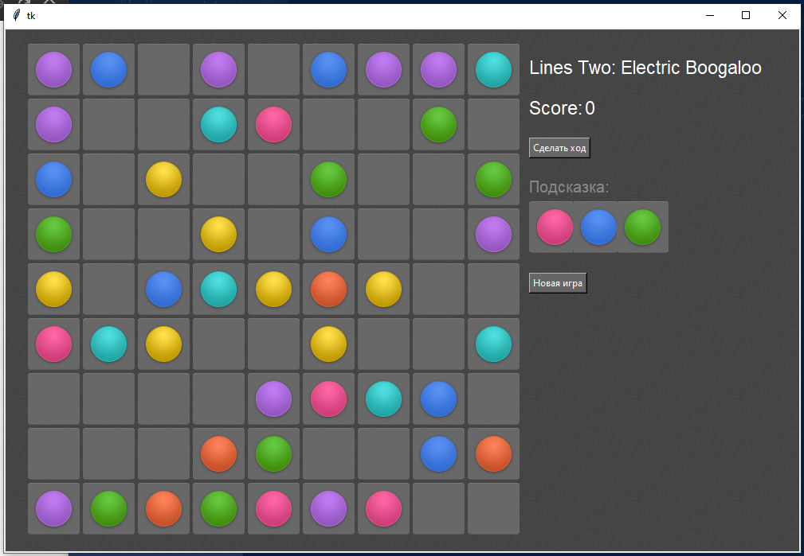
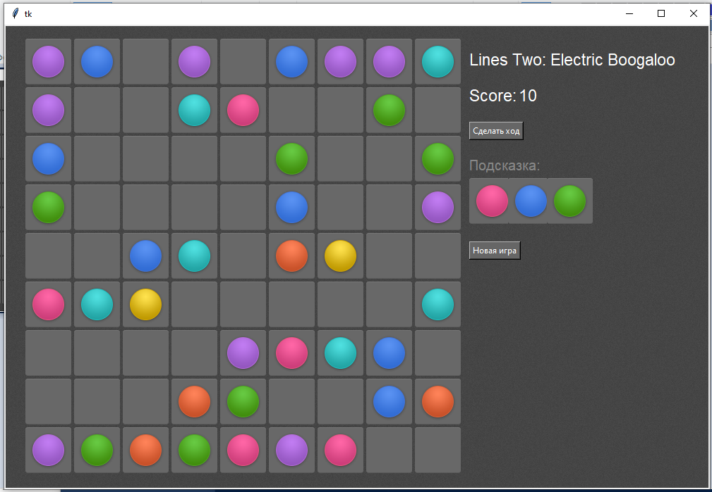
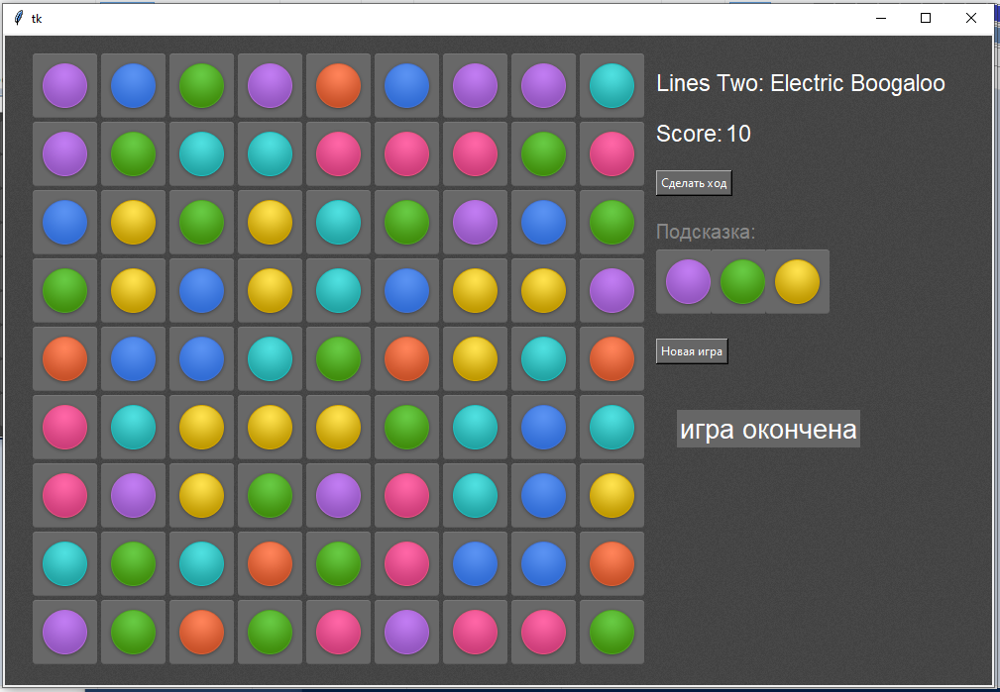

<p align="center">МИНИСТЕРСТВО НАУКИ  И ВЫСШЕГО ОБРАЗОВАНИЯ РОССИЙСКОЙ ФЕДЕРАЦИИ<br>
Федеральное государственное автономное образовательное учреждение высшего образования<br>
"КРЫМСКИЙ ФЕДЕРАЛЬНЫЙ УНИВЕРСИТЕТ им. В. И. ВЕРНАДСКОГО"<br>
ФИЗИКО-ТЕХНИЧЕСКИЙ ИНСТИТУТ<br>
Кафедра компьютерной инженерии и моделирования</p>
<br>
<h3 align="center">Отчёт по лабораторной работе № 2<br> по дисциплине "Программирование"</h3>
<br><br>
<p>студента 1 курса группы ПИ-б-о-202(2)<br>Феськова Ильи Станиславовича<br>
направления подготовки 09.03.04 "Программная инженерия"</p>
<br><br>
<table>
<tr><td>Научный руководитель<br> старший преподаватель кафедры<br> компьютерной инженерии и моделирования</td>
<td>(оценка)</td>
<td>Чабанов В.В.</td>
</tr>
</table>
<br><br>
<p align="center">Симферополь, 2020</p>
<hr>

## Цель

1. Закрепить навыки разработки программ с простым графическим интерфейсом пользователя на зыке Python при помощи библиотеки Tkinter;
2. Получить представление о разработке простых игровых приложений.

## Постановка задачи

1. Используя стандартный модуль для разработки программ с графическим интерфейсом Tkinter реализуйте игру Lines на зыке Python.
2. В качестве образца графического интерфейса использована [данная игра](http://game-shariki.ru/linii-2).

## Выполнение работы

В самом начале была задача сделать игровое поле, которое можно легко редактировать в реальном времени.
В первый раз игра была реализована с помощью класса Label, у которой имеется изображение клетки с
наложенным сверху шариком, однако столкнувшись с проблемой создания текста без своего фона в правой части,
было решено сделать один объект Canvas, помещённый в корневой frame, на котором и производятся все изменения.

Каждая клетка являвется экземпляром класса, который хранит цвет, размер и состояние, выбрана ли клетка и id объекта на canvas.
У каждого объекта есть функция, которая для неё генерирует новую картинку на основе полей экземпляра и
заменяет картинку на Canvas по уникальному id объекта.

Далее были реализованы надписи справа:
- название игры
- счёт
- подсказка
- кнопки "сделать ход" и "новая игра"

Для счёта запоминался id текста, который должен содержать текущий счёт (целое число) и по этому id изменялся счёт через функцию update_score().

Были реализованы функции генерации 3 случайных шариков самого большого размера (подсказки), которые помещались в специальный глобальный буфер, а так же
функция, которая перемещала шарики из буфера на игровое поле. Если нельзя разместить все шарики или после размещения шариков не оставалось пустых
клеток, то игра считается завершённой.

Кнопка "сделать ход" размещает шары из подсказки и генерирует новую.

Кнопка "новая игра" очищает поле, генерирует подсказку, размещает подсказку и снова её генерирует. Игра считается не завершённой.

При попытке перемещения клетки вызывается функция проверки, а можно ли из исходной клетки добраться до цели. Реализован алгоритм BFS (поиска в ширину),
заимствованный из ресурса GeeksForGeeks и переделанный под данное приложение.

После каждого хода делается проверка на 5 и более одинаковых шариков в ряд, столбец и диагональ, и за каждый удалённый шарик добавляется по 2 очка.
Это реализованно через массивы из массивов из ссылок на клетки игрового поля по вертикали, горизонтали и диагонали.

Скриншоты игрового процесса:


Рисунок 1. Игра "Шарики"


Рисунок 2. Игрок удалил ряд из жёлтых шаров по диагонали


Рисунок 3. Игрок проиграл (заполнилось игровое поле, показалось соответствующее сообщение об окончании игры)

Исходный код на Python:

<details>
<summary>Спойлер!</summary>
    
```python
import random
from tkinter import Tk, Button, Canvas, NW, W, TclError, Label

from PIL import Image, ImageTk

root = Tk()
root.geometry('1000x660')
# root.wm_attributes("-transparentcolor", 'grey')

_assets = {}
assets = {}
ball_by_index = []
game_over = False
game_over_label: Label = None

class Cell:
    uniqid: int = -1
    image: Image
    imagetk: ImageTk.PhotoImage
    color: int = -1
    variant: int = -1
    dark: bool = True
    row: int = -1
    col: int = -1

    def update_cell(self):
        if self.variant != -1:
            self.image = Image.new("RGBA", _assets['cell_dark'].size)
            self.image.paste(_assets[f'{ball_by_index[self.color]}_{self.variant}'], (5, 5))
            if self.dark:
                self.image = Image.alpha_composite(_assets['cell_dark'], self.image)
            else:
                self.image = Image.alpha_composite(_assets['cell_light'], self.image)
            
            self.imagetk = ImageTk.PhotoImage(self.image)
        else:
            if self.dark:
                self.imagetk = assets['cell_dark']
            else:
                self.imagetk = assets['cell_light']
        
        canvas.itemconfigure(self.uniqid, image=self.imagetk)

CellMatrix = []
FreeCells = []
HintItems = [Cell(), Cell(), Cell()]

cm_rows = []
cm_columns = []
cm_diags = []
cm_rdiags = []

N, M = 9, 9
gap = 4
global_padding = 20

ProcessClicks: bool = True
SelectedCell: Cell = None

def load_assets():
    global _assets, assets, ball_by_index
    _assets.update({
        "cell" : Image.open("assets/cell-bgr.png").convert('RGBA'),
        "page" : Image.open("assets/page-bgr.png").convert('RGBA'),
    })
    _assets.update({
        "cell_dark" : _assets["cell"].crop( (2, 1, 67, 66) ),
        "cell_light" : _assets["cell"].crop( (2, 70, 67, 135) ),
    })
    _assets_balls = {
        "pink"   : Image.open("assets/ball-pink.png").convert('RGBA'),
        "red"    : Image.open("assets/ball-red.png").convert('RGBA'),
        "yellow" : Image.open("assets/ball-yellow.png").convert('RGBA'),  
        "green"  : Image.open("assets/ball-green.png").convert('RGBA'),
        "aqua"   : Image.open("assets/ball-aqua.png").convert('RGBA'),
        "blue"   : Image.open("assets/ball-blue.png").convert('RGBA'),
        "violet" : Image.open("assets/ball-violet.png").convert('RGBA'),
    }
    for k, v in _assets_balls.items():
        for i in range(7):
            _assets[f"{k}_{i}"] = v.crop( (0, i*60, 55, i*60 + 55) )

    ball_by_index = [
        "pink",  
        "red",   
        "yellow",
        "green", 
        "aqua",  
        "blue",  
        "violet"
    ]
    for k, v in _assets.items():
        assets[k] = ImageTk.PhotoImage(v)

def update_background(canvas):
    bgimg = assets['page']

    root.update() # для обновления размеров

    #while y-bgimg.height() < root.winfo_height():
    #    while x-bgimg.width() < root.winfo_width():

    y = 0
    while y-bgimg.height() < canvas.winfo_height():
        x = 0
        while x-bgimg.width() < canvas.winfo_width():
            canvas.create_image(x, y,
                                image=bgimg)
            x += bgimg.width()  
            
        y += bgimg.height()
    
def create_cells():
    global CellMatrix, cm_columns, cm_rows
    for row in range(N):
        CellMatrix.append(list())
        cm_columns.append(list())
        for col in range(M):
            cell = Cell()
            
            cell.imagetk = assets['cell_dark']
            cell.row = row
            cell.col = col

            CellMatrix[row].append(cell)
            FreeCells.append(cell)

            cm_columns[row].append(cell)
    
    for col in range(M):
        cm_rows.append(list())
        for row in range(N):
            cm_rows[col].append(CellMatrix[row][col])
    
    if N > M:
        j = 0
        for shift in range(N-4):
            cm_diags.append(list())
            cm_rdiags.append(list())
            for i in range(M-shift):
                cm_diags[j].append(CellMatrix[i+shift][i])
                cm_rdiags[j].append(CellMatrix[M-i-shift-1][i])
            j += 1
        for shift in range(1, M-4):
            cm_diags.append(list())
            cm_rdiags.append(list())
            for i in range(N-shift):
                cm_diags[j].append(CellMatrix[i][i+shift])
                cm_rdiags[j].append(CellMatrix[M-i-1][i+shift])
            j += 1
    else:
        j = 0
        for shift in range(M-4):
            cm_diags.append(list())
            cm_rdiags.append(list())
            for i in range(N-shift):
                cm_diags[j].append(CellMatrix[i+shift][i])
                cm_rdiags[j].append(CellMatrix[N-i-shift-1][i])
            j += 1
        for shift in range(1, N-4):
            cm_diags.append(list())
            cm_rdiags.append(list())
            for i in range(M-shift):
                cm_diags[j].append(CellMatrix[i][i+shift])
                cm_rdiags[j].append(CellMatrix[N-i-1][i+shift])
            j += 1

def place_cells(canvas):
    global CellMatrix
    for row in range(len(CellMatrix)):
        for col in range(len(CellMatrix[0])):
            cell = canvas.create_image(
                10 + global_padding + gap*row + CellMatrix[row][col].imagetk.width()*row,
                global_padding + gap*col + CellMatrix[row][col].imagetk.height()*col,
                image=CellMatrix[row][col].imagetk,
                anchor=NW
            )
            canvas.tag_bind(cell,
                            '<Button-1>',
                            lambda event, thisrow=row, thiscol=col
                                : cell_click(event, thisrow, thiscol))
            CellMatrix[row][col].uniqid = cell
    
def create_info(canvas):
    global score, score_val, HintItems

    x_pos = global_padding + 639
    y_pos = global_padding + 30

    canvas.create_text(
        x_pos,
        y_pos,
        text="Lines Two: Electric Boogaloo", font=("Arial", 17), fill="white",
        anchor=W)

    y_pos += 51 - 13
    canvas.create_text(
        x_pos,
        y_pos,
        text="Score: ", font=("Arial", 17), fill="white",
        anchor=NW)
    
    score_val = 0
    score = canvas.create_text(
        x_pos + 70,
        y_pos,
        text=str(score_val), font=("Arial", 17), fill="white",
        anchor=NW)

    y_pos += 50
    Button(root, text='Сделать ход',
        fg='white', bg='#666666', activebackground='#777777', activeforeground='white',
        command=make_move).place(x=x_pos, y=y_pos)

    y_pos += 50
    canvas.create_text(
        x_pos,
        y_pos,
        text="Подсказка:", font=("Arial", 15), fill="#888888",
        anchor=NW)
    
    y_pos += 30
    HintItems[0].uniqid = canvas.create_image(
        x_pos,
        y_pos,
        image=assets['red_0'],
        anchor=NW)
    HintItems[1].uniqid = canvas.create_image(
        x_pos + 55,
        y_pos,
        image=assets['red_0'],
        anchor=NW)
    HintItems[2].uniqid = canvas.create_image(
        x_pos + 110,
        y_pos,
        image=assets['red_0'],
        anchor=NW)
    
    y_pos += 90
    Button(root, text='Новая игра',
        fg='white', bg='#666666', activebackground='#777777', activeforeground='white',
        command=new_game).place(x=x_pos, y=y_pos)

def update_score(canvas, inc=None, reset=None):
    global score_val
    if inc == None:
        if reset == None:
            return
        else:
            score_val = 0
    else:
        score_val += inc
    
    canvas.itemconfigure(score, text=str(score_val))

def cell_click(event, row, col):

    global ProcessClicks, SelectedCell
    if not ProcessClicks:
        return

    c = CellMatrix[row][col]

    if SelectedCell == None:
        if c.variant == -1:
            return
        c.dark = False
        c.update_cell()
        SelectedCell = c 
    else:
        if c.variant == -1:
            if not is_accessable(SelectedCell.row, SelectedCell.col, row, col):
                return
            c.variant = SelectedCell.variant
            c.color = SelectedCell.color
            c.update_cell()

            SelectedCell.color, SelectedCell.variant = -1, -1

            SelectedCell.dark = True
            SelectedCell.update_cell()

            SelectedCell = None
            make_move()
        elif c == SelectedCell:
            return
        else:
            SelectedCell.dark = True  
            SelectedCell.update_cell()

            c.dark = False
            c.update_cell()
            SelectedCell = c

def is_accessable(fromx, fromy, tox, toy):
    Dir = [ [0, 1], [0, -1], [1, 0], [-1, 0]]
    queue = [(fromx, fromy)]
    visited = [] 

    while len(queue) > 0:
        p = queue[0]
        queue.pop(0)

        if visited.count(p) > 0:
            continue 

        visited.append(p)

        if p == (tox, toy):
            return True
        
        for i in range(4):
            a = p[0] + Dir[i][0]
            b = p[1] + Dir[i][1]

            if a >= 0 and b >= 0 and a < N and b < M and visited.count((a, b)) == 0 and CellMatrix[a][b].variant == -1:
                queue.append((a, b))
    return False

def clear_list(list_):
    deleted_some = False
    for col in list_:
        count = 0
        for elem in range(len(col)-1):
            if col[elem].color == col[elem+1].color and col[elem].variant != -1:
                count += 1
            else:
                if count >= 4:
                    deleted_some = True
                    for i in range(count+1):
                        c = col[elem-i]
                        c.color = -1
                        c.variant = -1
                        c.update_cell()
                        update_score(canvas, inc=2)
                count = 0
        if count >= 4:
            deleted_some = True
            for i in range(count+1):
                c = col[elem-i]
                c.color = -1
                c.variant = -1
                c.update_cell()
                update_score(canvas, inc=2)

    return deleted_some

def clear_rows():
    if (    clear_list(cm_rows) or
            clear_list(cm_columns) or
            clear_list(cm_diags) or
            clear_list(cm_rdiags)):
        return False
    else:
        return True
    
def generate_hint_items():
    global HintItems
    for i in range(3):
        c = Cell()

        c.color = random.randint(0, 6)
        c.variant = 0
        c.uniqid = HintItems[i].uniqid
        c.dark = True
        c.update_cell()

        HintItems[i] = c
    pass

def place_hint_items():
    for i in range(3):
        if len(FreeCells) == 0:
            return False

        c = FreeCells[random.randint(0, len(FreeCells)-1)]

        c.color = HintItems[i].color
        c.variant = HintItems[i].variant
        c.update_cell()

        FreeCells.remove(c)
    return True

def make_move(event=None):
    global game_over

    if clear_rows():
        FreeCells.clear()
        for row in CellMatrix:
            for elem in row:
                if elem.variant == -1: FreeCells.append(elem)
        if not place_hint_items():
            game_over = True
            return
        FreeCells.clear()
        for row in CellMatrix:
            for elem in row:
                if elem.variant == -1: FreeCells.append(elem)
        if len(FreeCells) == 0:
            game_over = True
            return

        generate_hint_items()

    global SelectedCell
    if SelectedCell == None: return
    SelectedCell.dark = True
    SelectedCell.update_cell()
    SelectedCell = None

def new_game(event=None):
    global game_over_label
    global game_over
    game_over = False

    for row in range(N):
        for col in range(M):
            cell = CellMatrix[row][col]
            cell.dark = True
            cell.variant = -1
            cell.update_cell()

    update_score(canvas, reset=True)
    make_move()
    if game_over_label != None:
        game_over_label.destroy()
        root.update()
        game_over_label = None

if __name__ == '__main__':
    load_assets()

    canvas = Canvas(root, borderwidth=0, width=1000, height=1000)
    
    canvas.place(x=0, y=0,
                relwidth=1,
                relheight=1)

    create_cells()
    update_background(canvas)
    place_cells(canvas)
    create_info(canvas)

    generate_hint_items()
    place_hint_items()
    generate_hint_items()

    try:

        while True:
            root.update()
            if game_over:
                if game_over_label == None:
                    game_over_label = Label(root, font=('Arial', 20), text='игра окончена', fg='white', bg='#666666')
                    game_over_label.place(x=root.winfo_width()//2 + 180, y=root.winfo_height()//2 + 50)

            
    except TclError as e:
        exit()
    except Exception as e:
        print('Error:', e)
        exit()
```

</details>

## Вывод
Я продвинулся в своём знании Python и Tkinter, научился работать с объектами Canvas, Label, Button, создании классов и созданию простейших игр.
